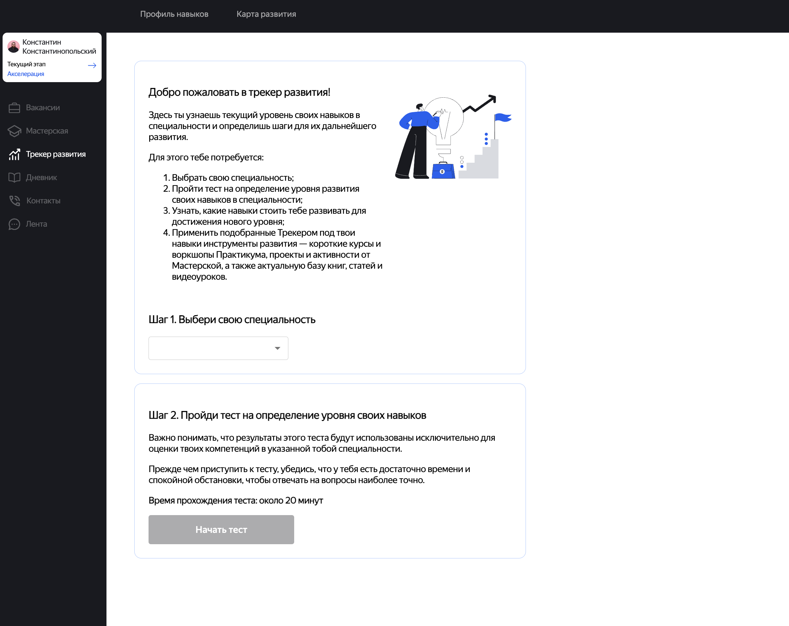
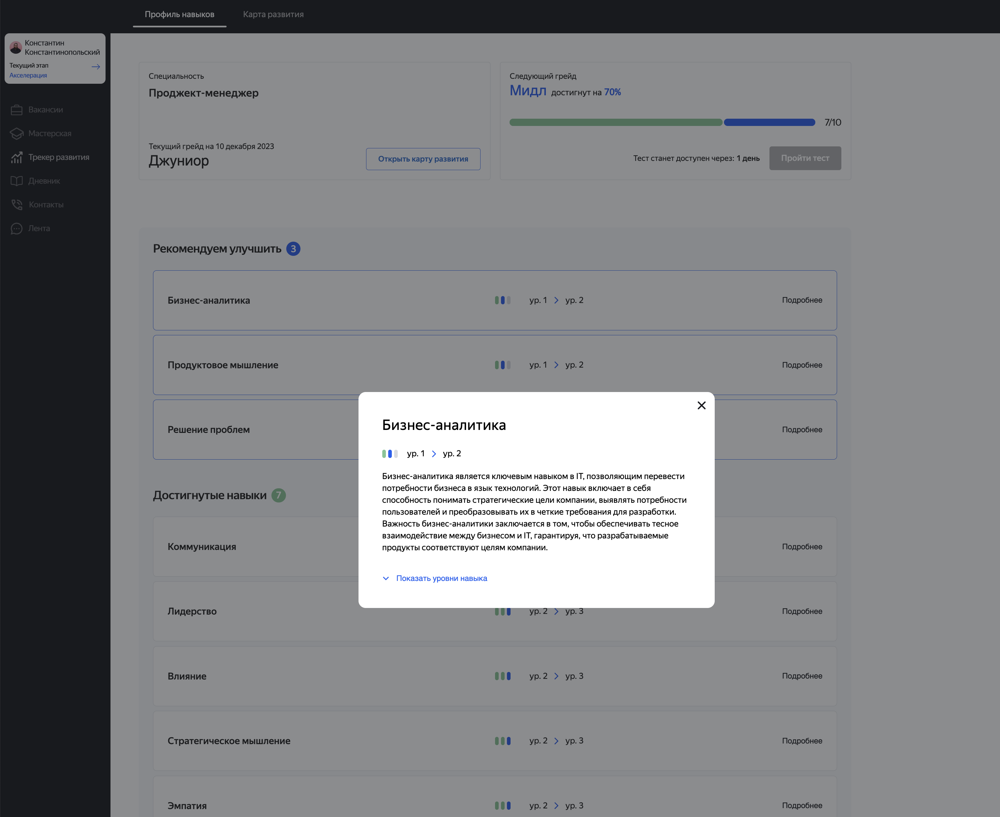
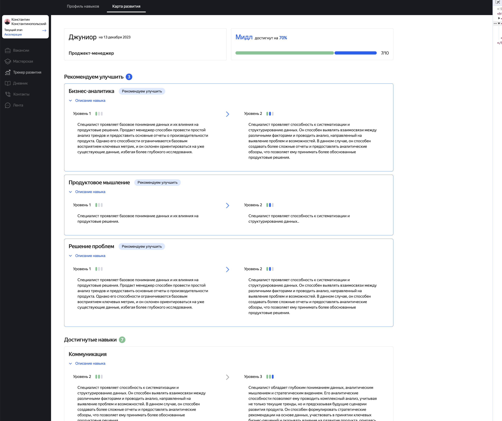

# Yandex Praktikum Hackathon 2023

# Проект для образовательной платформы Яндекс Практикум.

Этот проект представляет собой фронтенд для MVP Трекера развития. Проект добавляет новый функционал к сервису Карьерный трекер. Можно узнать свой текущий уровень навыков и грейд, посмотреть список навыков необходимых для развития, ознакомится с рекомендациями курсов, проектами Мастерской и ресурсами Базы знаний.

Пользователям доступна возможность выбора специальности и прохождение теста, чтобы узнать текущий уровень навыков, а также ознакомиться с рекомендациями, чтобы в дальнейшем повысить свой уровень компетенций.

Кроме того, на основе выбранной специальности и результатах пройденного теста формируются рекомендации на курсы яндекс практикума, проекты мастерской и ресурсы базы знаний.

Для доступа к функционалу требуется пройти бесплатную регистрацию.


## Инструкция по запуску ##
- клонировать репозиторий
```
git clone git@github.com:Hackaton-development-tracker/tracker-frontend.git
```
- перейти в директорию проекта, установить зависимости: 
```
npm i
```
- запустить сборку:
```
npm run build
```
- запустить проект: 
```
npm run dev
```

## Как использовать Docker ##
- из папки с проектом выполнить команду:
```
docker build -t [your docker image name] .
```
- чтобы проверить доступные образы, выполнить
```
docker images
```
- запустить контейнер
```
docker run -d --rm -p 5173:5173 --name [name of the container] [your docker image name]
```
- Используемые флаги:
```
-d - Запустить контейнер в фоновом режиме.
--rm - Удалить контейнер при его остановке.
-p - Отображение портов между контейнером и внешним миром.
```
- чтобы проверить, работает ли  контейнер Docker, выполнить команду:
```
docker ps
```

## Используемые технологии ##
- [TypeScript](https://www.typescriptlang.org/)
- [React](https://ru.reactjs.org/)
- [React Router](https://reactrouter.com/en/main)
- [Redux Toolkit](https://redux-toolkit.js.org/)
- [Material-UI](https://material-ui.com/)
- [React Hook Form](https://www.react-hook-form.com/)

- [date-fns](https://date-fns.org/)

## Команда фронтенд-разработчиков
- Андрей Симонов [github](https://github.com/2web)
- Елена Зотова [github](https://github.com/e-zotova)

## Скриншоты




